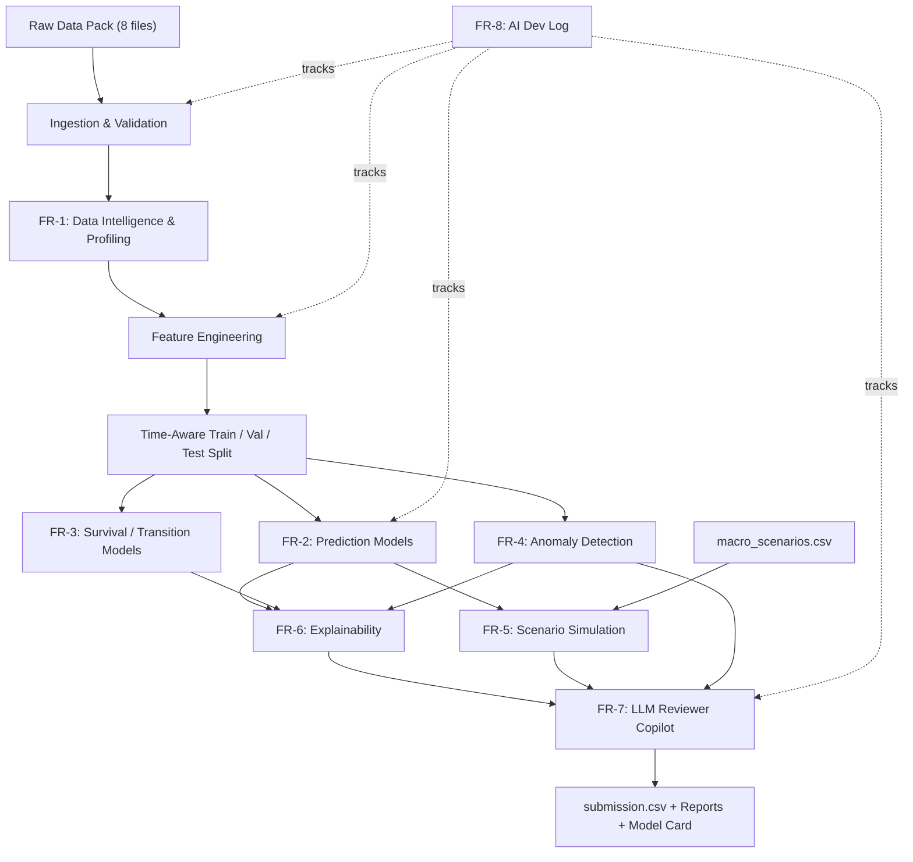

# Loan Performance Intelligence Engine — Product Requirements Document

**Document:** Product Requirements Document (PRD)
**Project:** Loan Performance Intelligence Engine
**Source:** Intain Campus FinTech Challenge 2026 — AI Track, Problem Statement (uploaded PDF)
**Prepared:** August 25, 2026
**Status:** Draft v1.1 — solo build, deadline **August 31, 2026**; data-pack availability still unconfirmed (see Section 2)

---

## Table of Contents
1. [Executive Summary](#1-executive-summary)
2. [Assumptions & Open Questions](#2-assumptions--open-questions)
3. [Goals & Success Criteria](#3-goals--success-criteria)
4. [Scope](#4-scope)
5. [Users & Stakeholders](#5-users--stakeholders)
6. [Data Requirements](#6-data-requirements)
7. [System Architecture](#7-system-architecture)
8. [Functional Requirements (FR-1 – FR-8)](#8-functional-requirements)
9. [Non-Functional Requirements](#9-non-functional-requirements)
10. [Submission File Specification](#10-submission-file-specification)
11. [Deliverables Checklist](#11-deliverables-checklist)
12. [Metrics & Evaluation Plan](#12-metrics--evaluation-plan)
13. [Rubric Traceability Matrix](#13-rubric-traceability-matrix)
14. [Phased Implementation Plan](#14-phased-implementation-plan)
15. [Risk Register](#15-risk-register)
16. [Demo Video Script (5 Minutes)](#16-demo-video-script-5-minutes)
17. [Definition of Done — Master Checklist](#17-definition-of-done--master-checklist)
18. [Advanced / Stretch Features](#18-advanced--stretch-features)
- [Appendix A — Field Glossary](#appendix-a--field-glossary)
- [Appendix B — Model Card Template](#appendix-b--model-card-template)
- [Appendix C — AI Development Log Template](#appendix-c--ai-development-log-template)

---

## 1. Executive Summary

The **Loan Performance Intelligence Engine** is a data-science-first system for loan-level portfolio analysis. It takes messy, panel-structured loan performance data and turns it into: a quantified data-quality picture, multi-outcome performance predictions (delinquency, default, prepayment, next-state), a time-to-event view of when those outcomes happen, anomaly/exception flags for unreliable records, scenario-based stress projections, human-readable explanations, and a governed LLM copilot that narrates — but never generates — the underlying numbers.

The organizers are explicit that this is **not an LLM-wrapper challenge**. The core predictive, survival, anomaly, and scenario work must come from trained ML/statistical models. The LLM's role is strictly downstream: explaining, summarizing, retrieving, and assisting a human reviewer — always as a labeled recommendation, never as the decision itself. A solution that only calls an LLM API for classification does not qualify, regardless of how well it's presented.

This PRD converts the problem statement's 8 required tasks, 9 judging criteria, and 13-item minimum bar into concrete functional requirements, a data schema, an architecture, a build sequence, and ready-to-fill templates, so the team can go from this document straight into implementation.

---

## 2. Assumptions & Open Questions

**Confirmed as of August 26, 2026:**
- Solo build — one person, no team to parallelize across. This materially changes §14, now rewritten as a day-by-day solo sprint instead of a team plan.
- **Deadline: August 31, 2026** — about 5 days from today. §14 is date-anchored to this.
- Data-pack availability is **still unconfirmed** — but now more actionable. This challenge runs on HackerEarth: Round 1 was an individual online screening (Aug 14–16), and Round 2 is the "Prototype Phase" this problem statement belongs to. Any data pack would be posted to your **HackerEarth dashboard for this specific challenge**, not a public website — check there first (two minutes), then start against synthetic data (§6.5) in parallel no matter what you find. Losing a day waiting is the easiest way to blow this timeline.

**Still assumed (correct these if they matter to you):**

| # | Assumption | Where it affects this PRD |
|---|---|---|
| 1 | LLM provider for FR-7 is Claude via the Anthropic API — any governed LLM API satisfies the requirement. | §8 FR-7 |
| 2 | `submission_template.csv`'s exact column names weren't attached, so §10 proposes a schema inferred from Sections 6 and 8 of the brief. | §10 |
| 3 | NFR performance planning assumes the high end of the stated range (~1,000,000 rows) only for a final full-scale run — your day-to-day dev loop should use a small synthetic sample instead (§14 speed tactics). | §9 |

**Open questions worth confirming with organizers directly:**
- Is there a fixed submission deadline / leaderboard cadence, or a single final judging pass?
- Do judges review the GitHub repo directly, or only the 5-minute video plus submission.csv?
- Is `exception_type` provided as a label in training data, or must categories be derived purely from `validation_rules.json`?
- HackerEarth's public challenge page describes Round 2 as **"Form Your Team"** — worth a quick check with organizers or HackerEarth support on whether solo entries are accepted for the Prototype Phase.

---

## 3. Goals & Success Criteria

- **Primary goal:** maximize judged score across all 9 rubric criteria (100 pts total) by fully satisfying every FR's acceptance criteria in §8.
- **Secondary goal:** produce outputs that would plausibly extend into a real reviewer-facing tool — the brief's "benchmarking lens" rewards systems that look like production loan-analytics platforms, not hackathon demos.
- **Definition of success:**
  - §17 Definition of Done is 100% checked.
  - Zero §4.3 hard disqualifiers triggered.
  - The 5-minute demo (§16) covers all 15 required flow steps from the brief.

---

## 4. Scope

### 4.1 In Scope
- Data profiling, quality scoring, and drift detection (Task 1)
- Multi-outcome supervised prediction with time-aware validation (Task 2)
- Survival / hazard / transition modeling (Task 3)
- Hybrid rule + ML anomaly and exception detection (Task 4)
- Scenario and stress simulation (Task 5)
- Global and local explainability (Task 6)
- Grounded, logged, human-reviewed LLM copilot (Task 7)
- Continuous AI Development Log (Task 8)
- All Section 11 deliverables, including model card, reports, submission.csv, and demo video

### 4.2 Out of Scope / Non-Goals
- Structured-finance domain modeling beyond what's needed for tabular ML (the brief explicitly says no structured-finance background is required)
- Production deployment, authentication, or a persistent hosted service — this is a hackathon deliverable, not a shipped product
- Real-money transaction processing or integration with actual servicer systems
- Any UI beyond what's needed to demo the copilot and explanations (a notebook, simple Streamlit app, or CLI is sufficient)

### 4.3 Hard Disqualifiers — Never Do These
Directly from the brief's Section 13, restated as build rules:

1. Never rely on an LLM API as the *prediction mechanism* for delinquency, default, prepayment, next-state, or anomaly scores — these must come from trained models (FR-2/FR-3/FR-4).
2. Never skip training a non-LLM model for any required target.
3. Never use a random row-level split — always time-aware; justify any loan-level grouping explicitly.
4. Never include a feature only knowable after the prediction horizon (target leakage) — audit every feature's availability timestamp before using it.
5. Never submit work that can't be re-run end-to-end from raw data to `submission.csv`.
6. Never report a model without the metrics required in §12.
7. Never fabricate or cherry-pick results — every reported number must come from an actual run on held-out data.
8. Never use the public reference datasets (Fannie Mae, Freddie Mac, HMDA) outside their published terms of use, even for inspiration/testing.
9. Never ship a model the team can't explain to a judge on the spot (tie to FR-6).
10. Never present an LLM-generated narrative to a reviewer without grounding it in retrieved, structured context (tie to FR-7).

---

## 5. Users & Stakeholders

| Stakeholder | What they need from this system |
|---|---|
| **Judges** | A 5-minute demo covering all 15 flow steps (§16), plus a repo that substantiates every claim — profiling report, model metrics, survival curves, anomaly examples, scenario output, explanations, LLM logs, AI dev log. |
| **Portfolio Reviewer persona** (the implied end-user of Task 7) | A human analyst who currently reviews flagged loans manually. Needs an anomaly/exception list with drivers, LLM-drafted notes they can accept/edit/reject, and scenario summaries — never an unexplained number. |
| **You** | A repo structure organized enough to move through solo without losing track of what's done (§7.2, §14 day-by-day plan). |

---

## 6. Data Requirements

### 6.1 Data Pack Inventory

| File | Purpose | Notes |
|---|---|---|
| `loan_monthly_performance_train.csv` | Panel data, one row per loan per month; 250K–1M rows; static + monthly features + target labels | Primary training file |
| `loan_monthly_performance_test.csv` | Unlabeled test set for final scoring | Submit probabilities, anomaly scores, reviewer actions |
| `loan_static_attributes.csv` | Origination-level info: original balance, credit-score band, LTV band, DTI band, state, loan purpose, property type, vintage | Joins to panel on `loan_id` |
| `servicer_updates.csv` | Second-source file with partial/conflicting updates | Drives FR-4's conflict detection and stale-record logic |
| `data_dictionary.md` | Plain-English field definitions | Also used as FR-7's grounding source |
| `validation_rules.json` | Starter deterministic checks: balance consistency, date validity, delinquency consistency, closed/prepaid status, document gaps | Combine with ML anomaly scores in FR-4 |
| `macro_scenarios.csv` | Base / adverse-credit / high-prepayment scenario assumptions | Drives FR-5 |
| `submission_template.csv` | Required output format | See §10 for the schema this PRD assumes until the real file is issued |

> **Compliance note (ties to disqualifier #8):** if the team pulls any real data from Fannie Mae, Freddie Mac, or HMDA (rather than organizer-provided or synthetic data) for inspiration or testing, review each source's terms of use first — Fannie Mae and Freddie Mac require registration/agreement, HMDA is public but has its own usage guidance.

### 6.1a Public Reference Sources (links verified Aug 26, 2026)

These are the public sources the brief names as inspiration — not the organizer's data pack itself. Two of the six original links pointed to stale deep-links; corrected below.

| Source | Status | URL |
|---|---|---|
| Fannie Mae Single-Family Loan Performance Data | ✅ Live | https://capitalmarkets.fanniemae.com/credit-risk-transfer/single-family-credit-risk-transfer/fannie-mae-single-family-loan-performance-data |
| Fannie Mae Data Dynamics | ⚠️ Corrected — the original `#/reportMenu;category=Loan_Performance` fragment is stale | https://datadynamics.fanniemae.com/data-dynamics/ |
| Freddie Mac Single-Family Loan-Level Dataset | ✅ Live | https://www.freddiemac.com/research/datasets/sf-loanlevel-dataset |
| Freddie Mac Clarity Data Intelligence Download Portal | ⚠️ Corrected — bare domain now needs the `/CRT/` path to reach the actual download page | https://claritydownload.fmapps.freddiemac.com/CRT/ |
| HMDA Data Publication | ✅ Live | https://ffiec.cfpb.gov/data-publication/ |
| HMDA Public LAR Data Fields | ✅ Live | https://ffiec.cfpb.gov/documentation/publications/loan-level-datasets/lar-data-fields |

All three institutions require free registration for actual data/dashboard access (the landing pages above are public, the datasets behind them are not) — irrelevant if you stick to organizer-provided or synthetic data per §6.5, but budget time for it if you don't.

### 6.2 Core Panel Schema

| Field | Type | Description |
|---|---|---|
| `loan_id` | string / ID | Unique loan identifier, constant across all monthly records |
| `month_index` | integer | Sequential index of the observation month for a loan (1, 2, 3, …) |
| `reporting_month` | date (YYYY-MM) | Calendar month of this performance record |
| `origination_month` | date (YYYY-MM) | Month the loan was originated |
| `loan_age_months` | integer | Months since origination as of `reporting_month` |
| `remaining_term_months` | integer | Months remaining to scheduled maturity |
| `original_balance` | numeric (currency) | Balance at origination |
| `current_balance` | numeric (currency) | Outstanding balance as of `reporting_month` |
| `interest_rate` | numeric (%) | Note interest rate |
| `credit_score_band` | ordinal categorical | Binned credit score at origination |
| `ltv_band` | ordinal categorical | Binned loan-to-value ratio |
| `dti_band` | ordinal categorical | Binned debt-to-income ratio |
| `state` | categorical | Property location |
| `loan_purpose` | categorical | Purchase / refinance-rate-term / refinance-cashout, etc. |
| `occupancy_type` | categorical | Owner-occupied / second home / investment |
| `property_type` | categorical | Single-family / condo / multi-unit, etc. |
| `servicer_name` | categorical | Servicer of record |
| `current_status` | categorical | Current / 30-60-90+ DPD / Default / Prepaid / Modified |
| `days_past_due` | integer | Days past due as of `reporting_month` |
| `modification_flag` | boolean | Whether the loan has been modified |
| `prepayment_flag` | boolean | Whether prepaid in this reporting period |
| `default_flag` | boolean | Whether in default as of this reporting period |
| `loss_severity_band` | ordinal categorical | Binned loss severity if defaulted |
| `last_updated_at` | datetime | Last record update timestamp (used for staleness checks) |
| `source_system` | categorical | System/source that produced the record |
| `document_status` | categorical | Completeness status of supporting documents |

Full plain-English glossary in **Appendix A**.

### 6.3 Target Variables

| Target | Type | Description |
|---|---|---|
| `next_3m_delinquency_flag` | binary | Becomes delinquent within 3 months |
| `next_6m_delinquency_flag` | binary | Becomes delinquent within 6 months |
| `next_12m_default_flag` | binary | Defaults within 12 months |
| `next_12m_prepayment_flag` | binary | Prepays within 12 months |
| `next_state` | multi-class | Loan status at the next observation |
| `exception_required` | binary | Whether the record needs manual reviewer exception |
| `exception_type` | categorical | Category of exception, if required |

### 6.4 Validation Rules (starter set to implement from `validation_rules.json`)
- Balance consistency (e.g., `current_balance` should not exceed `original_balance` outside documented exceptions like capitalized fees)
- Date validity (`origination_month ≤ reporting_month`; `last_updated_at ≥ reporting_month`)
- Delinquency consistency (`days_past_due` bucket must agree with `current_status`)
- Closed/prepaid status logic (no further balance activity after prepayment/default closure, unless explicitly modeled)
- Document gaps (`document_status` completeness thresholds)

### 6.5 Fallback: Synthetic Data Generation Plan

Use this if the organizer's real files aren't available yet — build the pipeline against this first, then swap in real files (column-compatible, so it's a drop-in replacement).

1. **Simulate static attributes** for N loans (start with 5,000–20,000 for fast iteration; scale to 250K+ for a final run) using realistic distributions for credit-score band, LTV band, DTI band, state, loan purpose, property type, vintage, original balance, rate, and term.
2. **Simulate the monthly panel** by rolling each loan forward through a Markov-style state-transition process conditioned on static attributes (e.g., lower credit-score bands get higher delinquency-transition probability). This naturally produces the target flags by looking ahead within the simulation, and keeps the "ground truth" transition process known and auditable.
3. **Inject realistic messiness:** missing values (both random and pattern-based), outliers, a handful of invalid dates, and — for the `servicer_updates.csv` counterpart — duplicate/conflicting updates with mismatched timestamps, to exercise FR-4's reconciliation logic.
4. **Match the documented schema exactly** (same column names as §6.2/§6.3), and use the same time-based train/test split logic that will be used on the real leaderboard data.
5. **Document the generator's parameters and seed** in the repo — this is dev data, not the official scored dataset, and should be labeled as such everywhere it's used.

---

## 7. System Architecture

### 7.1 Pipeline Overview



FR-3 (survival) and FR-4 (anomaly) are largely independent of each other and can be built in parallel once the shared feature set and split (Phase 2) exist. FR-5 depends on FR-2's trained models; FR-6 depends on FR-2/FR-3/FR-4; FR-7 depends on FR-4 and FR-6 outputs to ground on.

### 7.2 Repository Structure

```
loan-performance-intelligence-engine/
├── README.md
├── AI_DEVELOPMENT_LOG.md
├── MODEL_CARD.md
├── requirements.txt
├── data/
│   ├── raw/                 # organizer-provided or synthetic
│   ├── interim/
│   └── processed/
├── notebooks/
│   ├── 01_data_profiling.ipynb
│   ├── 02_feature_engineering.ipynb
│   ├── 03_prediction_models.ipynb
│   ├── 04_survival_modeling.ipynb
│   ├── 05_anomaly_detection.ipynb
│   ├── 06_scenario_simulation.ipynb
│   ├── 07_explainability.ipynb
│   └── 08_llm_copilot_demo.ipynb
├── src/
│   ├── data/                # ingestion, validation, synthetic generator
│   ├── features/
│   ├── models/               # FR-2 training scripts
│   ├── survival/              # FR-3
│   ├── anomaly/               # FR-4
│   ├── scenario/               # FR-5
│   ├── explainability/          # FR-6
│   ├── llm_copilot/              # FR-7: grounding, prompt templates, logging
│   └── utils/
├── reports/
│   ├── data_intelligence_report.md
│   ├── explainability_report.md
│   └── scenario_report.md
├── submission/
│   └── submission.csv
├── logs/
│   └── llm_prompt_log.jsonl
├── tests/
└── demo/
    └── demo_script.md
```

---

## 8. Functional Requirements

Each FR follows the same structure: Objective, Requirements, Inputs, Outputs, Acceptance Criteria, Rubric Weight.

### FR-1: Data Intelligence & Profiling
**Objective:** Establish a quantified, trustworthy picture of data quality and structure before any modeling begins.

**Requirements:**
1. Per-column distribution summaries for every field (numeric: mean/median/std/percentiles/skew; categorical: cardinality, top categories, rare-category share).
2. Missingness report: % missing per column, missingness patterns by segment (state, servicer, vintage), missingness matrix.
3. Univariate outlier detection (IQR / z-score) and multivariate outlier detection (Isolation Forest / Mahalanobis distance) on key numeric fields.
4. Date-logic validation: `origination_month ≤ reporting_month`; `loan_age_months` consistent with the month gap; `remaining_term_months + loan_age_months` roughly consistent with original term; `last_updated_at` not before `reporting_month`.
5. Cross-field consistency checks: `days_past_due` bucket vs. `current_status`; `prepayment_flag`/`default_flag` co-occurrence logic; `current_balance` vs. `original_balance` relationship.
6. Correlation/association analysis: Pearson/Spearman for numeric pairs, Cramér's V or mutual information for categorical pairs; surface the most dependent field pairs.
7. Association-rule mining (Apriori/FP-Growth) over categorical/flag fields to surface co-occurrence patterns (e.g., which state + servicer + loan_purpose combinations co-occur with high exception rates).
8. Train vs. test drift per feature (PSI or KS-test); flag high-drift features.
9. Record-level `data_quality_score` (composite of completeness, validity, consistency) and a batch/segment-level rollup.

**Inputs:** all 8 data-pack files
**Outputs:** `data_intelligence_report`, `data_quality_score` column, batch-level quality summary table

**Acceptance Criteria:**
- [ ] Every field has a documented distribution summary
- [ ] Missingness quantified and visualized
- [ ] At least one univariate and one multivariate outlier method applied
- [ ] Date/logical/cross-field checks implemented with violation counts reported
- [ ] Correlation/association analysis completed, top dependent pairs called out
- [ ] Association-rule mining run, top rules reported
- [ ] Train/test drift measured per feature
- [ ] Record-level and batch-level quality scores produced

**Rubric Weight:** 15 pts

---

### FR-2: Loan Performance Prediction
**Objective:** Predict multiple forward-looking outcomes using calibrated, non-LLM supervised models validated with time-aware methodology.

**Requirements:**
1. Train models for all five targets: `next_3m_delinquency_flag`, `next_6m_delinquency_flag`, `next_12m_default_flag`, `next_12m_prepayment_flag`, `next_state`.
2. Use a strictly time-aware split (train on `reporting_month ≤ T1`, validate `T1 < month ≤ T2`, test `month > T2`) — never random row-level. Document the exact cutoff and confirm no future-month leakage into a loan's own training rows.
3. Build a baseline (logistic regression / shallow GBM) *and* an improved model (LightGBM/XGBoost/CatBoost, tuned) per target — report both.
4. Handle class imbalance explicitly (class weights, resampling, or threshold optimization) — most targets are rare-event.
5. Calibrate probabilities (Platt scaling or isotonic regression); report calibration curves and Brier score.
6. Report ROC-AUC, PR-AUC, F1, recall at a fixed precision operating point (e.g., recall @ 80% precision), Brier score, and macro-F1 for `next_state`.
7. Produce calibrated probabilities for every test-set row, matching §10's submission schema.

**Inputs:** engineered features, time-aware splits
**Outputs:** trained model artifacts, per-target metrics report (baseline vs. improved), calibrated test-set probabilities

**Acceptance Criteria:**
- [ ] All 4 binary targets + `next_state` modeled with non-LLM supervised methods
- [ ] Time-aware split implemented and documented
- [ ] Baseline and improved model both trained and compared
- [ ] Class imbalance strategy documented and applied
- [ ] Calibration performed and reported
- [ ] All §12 metrics computed per target

**Rubric Weight:** 20 pts — the single highest-weighted criterion

---

### FR-3: Time-to-Event / Survival Modeling
**Objective:** Model *when* events happen, not just *whether*, respecting censoring in the panel.

**Requirements:**
1. Implement at least one of: Kaplan-Meier + Cox Proportional Hazards, a discrete-time hazard model (pooled logistic regression per loan-month — recommended given the panel structure), Random Survival Forest, a competing-risks approximation (e.g., cause-specific hazards treating default and prepayment as competing events), or a monthly Markov-style transition model across `current_status` states.
2. Correctly treat loans still current at the end of the observation window as right-censored, not as "no event."
3. Produce event/cumulative-incidence curves overall and by segment (credit-score band, vintage).
4. Explicitly document how censoring or multi-state transitions are handled — must be explainable to a judge.
5. Compare against a simple baseline (e.g., flat empirical hazard rate) to show the model adds value.

**Inputs:** panel status history, `loan_age_months`, event flags
**Outputs:** survival/transition model artifact, event-curve visualizations, `next_state` transition probabilities

**Acceptance Criteria:**
- [ ] At least one survival/hazard/transition model implemented
- [ ] Censoring treatment explicitly documented
- [ ] Event curves produced, overall and segmented
- [ ] Comparison against a simpler baseline included

**Rubric Weight:** 15 pts

---

### FR-4: Anomaly & Exception Detection
**Objective:** Surface statistically unusual or rule-violating records with explainable, reviewer-ready context.

**Requirements:**
1. Generate a continuous record-level `anomaly_score` (Isolation Forest / LOF / autoencoder reconstruction error) combined with deterministic checks from `validation_rules.json` — a hybrid rule + ML approach.
2. Predict `exception_required` (binary) and `exception_type` (categorical — e.g., balance_mismatch, stale_servicer_update, invalid_date, delinquency_status_conflict, document_gap), derived from validation rules and any provided labels.
3. Explain anomaly drivers per flagged record (which fields/rules contributed).
4. Curate **at least 20 reviewer-ready examples**: record ID, anomaly score, exception type, driver explanation, suggested action.
5. Use `servicer_updates.csv` for source-conflict detection: reconcile conflicting fields against the primary panel, apply stale-record precedence logic (e.g., latest `last_updated_at` wins, or a defined source priority), and flag unresolved conflicts as exceptions.

**Inputs:** panel data, `servicer_updates.csv`, `validation_rules.json`
**Outputs:** `anomaly_score` / `exception_type` / `exception_probability` columns, 20+ curated examples doc, reconciliation log

**Acceptance Criteria:**
- [ ] Record-level anomaly score produced
- [ ] Exception probability and type predicted
- [ ] Anomaly drivers explained per record
- [ ] ≥20 reviewer-ready examples documented
- [ ] Servicer-conflict reconciliation logic implemented and tested

**Rubric Weight:** 10 pts

---

### FR-5: Scenario & Stress Simulation
**Objective:** Project portfolio performance under defined macro scenarios and explain what's driving the change.

**Requirements:**
1. Apply base, adverse-credit, and high-prepayment assumptions from `macro_scenarios.csv` to the modeling population (via feature perturbation and/or scenario-conditioned model input).
2. Produce projected delinquency, default, and prepayment rates under each scenario.
3. Break projections out by at least one segment: vintage, credit-score band, state, or servicer.
4. Explain top scenario drivers (which features/segments move most under stress).

**Inputs:** FR-2 models, `macro_scenarios.csv`, engineered features
**Outputs:** `scenario_report` with projected rates per scenario, segment tables, driver explanation

**Acceptance Criteria:**
- [ ] All 3 scenarios implemented
- [ ] Projected delinquency, default, prepayment rates produced per scenario
- [ ] Segment-level breakdown included
- [ ] Top scenario drivers explained

**Rubric Weight:** 10 pts

---

### FR-6: Explainability Layer
**Objective:** Make every model's behavior interpretable to a non-ML reviewer, with honest treatment of uncertainty and errors.

**Requirements:**
1. Global feature importance per model (SHAP summary plots / permutation importance).
2. Local explanation for individual records (SHAP waterfall/force plot) — required for the demo's single-loan walkthrough.
3. Report model confidence/uncertainty (calibrated probability + prediction interval, or ensemble variance).
4. Analyze false positives and false negatives with concrete examples and hypothesized causes.
5. Cover default, delinquency, prepayment, and anomaly-score outputs — not just one model.

**Inputs:** trained models from FR-2/FR-3/FR-4, held-out evaluation set
**Outputs:** `explainability_report` with global/local plots, uncertainty reporting, FP/FN analysis

**Acceptance Criteria:**
- [ ] Global feature importance produced for each core model
- [ ] At least one local, single-record explanation produced
- [ ] Confidence/uncertainty reported
- [ ] FP/FN analysis included with examples

**Rubric Weight:** 10 pts

---

### FR-7: LLM-Assisted Reviewer Copilot
**Objective:** Use an LLM to translate model outputs into grounded, reviewer-facing narrative — strictly a recommendation layer, never the source of predictions.

**Requirements:**
1. Use an LLM (Claude via the Anthropic API recommended; any governed LLM API is acceptable) for: grounded risk-profile summaries, reviewer notes for flagged exceptions, data-dictionary term lookups, validation-rule explanations, scenario-result narration, and/or natural-language Q&A over model outputs.
2. Ground every output in retrieved, structured context (predictions, SHAP values, anomaly flags, `data_dictionary.md`, `validation_rules.json`) — the LLM narrates numbers it's given, never invents them.
3. Log every call: timestamp, model name/version, prompt (or template + filled variables), retrieved context references, raw output, human review status (accepted/edited/rejected).
4. Label every LLM artifact visibly as **"Recommendation — not a decision,"** routed through a human-in-the-loop review step before any action is taken.
5. Document at least a few concrete examples where the LLM was wrong, vague, or overconfident, and how that was caught — this is explicitly graded, don't omit it.

**Inputs:** FR-2/FR-3/FR-4/FR-6 outputs, `data_dictionary.md`, `validation_rules.json`, FR-5 scenario results
**Outputs:** `llm_prompt_log.jsonl`, sample reviewer notes, LLM copilot demo, documented failure examples

**Acceptance Criteria:**
- [ ] LLM used only for explanation/summary/retrieval/assistance — never as the source of predictions or anomaly scores
- [ ] All outputs grounded in retrieved/structured context
- [ ] Prompt log implemented with all required fields
- [ ] "Recommendation not decision" labeling applied consistently
- [ ] At least a few documented LLM failure/rejection examples included

**Rubric Weight:** 10 pts

---

### FR-8: Agentic ML Development Evidence
**Objective:** Transparently document how AI coding tools were used, with evidence of human oversight.

**Requirements:**
1. Maintain a **running** AI Development Log (not written retroactively at the end) covering: tools used, representative prompts, accepted output examples, rejected/corrected output examples and why, human review process, approximate AI-generated vs. hand-written code share, and lessons learned.

**Inputs:** the development process itself
**Outputs:** `AI_DEVELOPMENT_LOG.md` (template in Appendix C)

**Acceptance Criteria:**
- [ ] Tools used are listed
- [ ] Representative prompts included
- [ ] At least one accepted and one rejected/corrected example included
- [ ] Human review process described
- [ ] Approximate AI-generated code share estimated
- [ ] Lessons learned included

**Rubric Weight:** 5 pts — also part of the Minimum Acceptable Solution and named as its own deliverable

---

## 9. Non-Functional Requirements

| Category | Requirement |
|---|---|
| **Reproducibility** | Pinned dependencies (`requirements.txt`), fixed random seeds, single entry point (e.g., `python -m src.run_pipeline --stage all`), documented run order in README. |
| **Scale** | Pipeline must run cleanly at up to ~1,000,000 panel rows. Standard vectorized pandas is sufficient at this scale (well under a GB in memory) — polars/duckdb are optional accelerants for iteration speed, not a requirement. |
| **Code quality** | Modular functions, type hints, docstrings, basic linting; unit tests for the time-split logic, leakage audit, and servicer-reconciliation logic specifically (these are the highest-risk areas per §15). |
| **Documentation** | README covering setup, architecture, and how to reproduce every deliverable in §11. |
| **Traceability** | Prompt log is append-only; model artifacts are versioned (tie to `model_version` in §10). |
| **Integrity** | No fabricated results — every reported metric comes from an actual held-out evaluation run (tie to disqualifier #7). |

---

## 10. Submission File Specification

`submission_template.csv` wasn't attached to the brief. This schema is **inferred** from Sections 6 and 8 ("probabilities, next state, exception type, anomaly score, top drivers, action, and confidence") — replace column names with the literal template the moment organizers issue it; the underlying values below are what needs to be produced regardless.

| Column | Type | Description | Source FR |
|---|---|---|---|
| `loan_id` | string | Loan identifier | — |
| `reporting_month` | date | As-of month for this test row | — |
| `next_3m_delinquency_prob` | float [0,1] | Calibrated probability | FR-2 |
| `next_6m_delinquency_prob` | float [0,1] | Calibrated probability | FR-2 |
| `next_12m_default_prob` | float [0,1] | Calibrated probability | FR-2 |
| `next_12m_prepayment_prob` | float [0,1] | Calibrated probability | FR-2 |
| `predicted_next_state` | categorical | Most likely next state | FR-2 / FR-3 |
| `exception_required_flag` | boolean | Whether record needs review | FR-4 |
| `exception_type` | categorical | Exception category, if any | FR-4 |
| `exception_probability` | float [0,1] | Confidence in exception call | FR-4 |
| `anomaly_score` | float | Continuous anomaly score | FR-4 |
| `top_drivers` | string (delimited list) | Top contributing features/rules | FR-6 |
| `recommended_action` | string | Suggested reviewer action | FR-7 |
| `confidence` | float [0,1] | Overall model confidence | FR-2/FR-6 |
| `model_version` | string | Model artifact version tag | NFR traceability |

---

## 11. Deliverables Checklist

| Deliverable | Description | Owner |
|---|---|---|
| [ ] GitHub repository | Complete source code, structured per §7.2 | |
| [ ] Reproducible notebook/scripts | End-to-end dev + scoring workflow | |
| [ ] `submission.csv` | Predictions in the required format (§10) | |
| [ ] Model card | Objective, data, features, model type, validation method, metrics, limitations, leakage controls, known failure modes (Appendix B) | |
| [ ] Data intelligence report | Profiling, missingness, outliers, drift, relationship checks, top anomalies (FR-1) | |
| [ ] Explainability report | Global/local importance, FP/FN, uncertainty (FR-6) | |
| [ ] Scenario report | Base/adverse/high-prepayment outputs (FR-5) | |
| [ ] LLM copilot demo | Grounded reviewer explanation / NL analysis (FR-7) | |
| [ ] AI Development Log | Continuous log, not retroactive (Appendix C) | |
| [ ] Five-minute demo video | End-to-end flow (§16) | |

---

## 12. Metrics & Evaluation Plan

| Task | Metrics | Notes |
|---|---|---|
| FR-2 binary targets | ROC-AUC, PR-AUC, F1, Recall @ fixed precision (e.g., 80%), Brier score | PR-AUC and Recall@Precision matter most given class imbalance |
| FR-2 `next_state` | Macro-F1, per-class precision/recall, confusion matrix | |
| FR-3 survival/transition | Concordance index (if Cox-based), log-rank test across segments, calibration of predicted vs. observed event rates at fixed horizons | |
| FR-4 anomaly/exception | Precision@K against labeled/rule-derived exceptions, `exception_type` macro-F1, qualitative review of the 20 curated examples | |
| FR-5 scenario | Directional sanity checks (adverse-credit ↑ default vs. base; high-prepayment ↑ prepayment vs. base), segment-level rate tables | |
| FR-1 data quality | % fields profiled, missingness coverage, drift flags (PSI/KS thresholds), validation-rule pass rate | |
| FR-6 explainability | Coverage ratio (models with global+local explanations / total models), documented FP/FN examples | |
| FR-7 LLM copilot | # grounded outputs logged, # human review actions logged, # documented failure examples | |

---

## 13. Rubric Traceability Matrix

| Judging Criterion | Points | PRD Section(s) | Required Artifact |
|---|---|---|---|
| Predictive Modeling | 20 | FR-2 (§8) | Model metrics report |
| Data Intelligence and Profiling | 15 | FR-1 (§8), §6 | `data_intelligence_report` |
| Time-to-Event / Transition Modeling | 15 | FR-3 (§8) | Survival notebook, event curves |
| Anomaly and Exception Intelligence | 10 | FR-4 (§8) | 20+ anomaly examples doc |
| Scenario and Stress Simulation | 10 | FR-5 (§8) | `scenario_report` |
| Explainability and Responsible AI | 10 | FR-6 (§8), §4.3 | `explainability_report`, model card |
| Smart LLM Usage | 10 | FR-7 (§8) | `llm_prompt_log`, copilot demo |
| ML Engineering and Reproducibility | 5 | §7, §9 | Repo structure, README |
| Agentic Coding Evidence | 5 | FR-8 (§8) | `AI_DEVELOPMENT_LOG.md` |
| **Total** | **100** | | |

**Priority insight:** more than half the score (50/100) comes from just three areas — Predictive Modeling, Data Intelligence, and Time-to-Event Modeling. If time gets tight, protect FR-1, FR-2, and FR-3 before investing further in FR-5 through FR-8.

---

## 14. Phased Implementation Plan

*Solo sprint — August 26 to 31, 2026 (today through deadline).*

### Strategy: breadth first, then depth
With one person and ~5 days against a 9-criterion additive rubric, the highest-scoring approach is **not** to perfect 2–3 tasks and skip the rest — it's to get a working, defensible version of **all 8 tasks** done fast (a thin vertical slice), then spend remaining time deepening the highest-point areas. Going from "not attempted" to "solid baseline" in a 10-point category is worth more than going from "solid" to "excellent" in a 20-point one — and it means you always have a submittable, disqualifier-safe project no matter when the clock runs out.

**Speed tactics to hold onto all week:**
- Iterate on a small synthetic sample (2,000–5,000 loans), not the full 250K–1M rows — scale up only for a final run, if at all.
- One shared feature-engineering + time-split module feeds every model (§7.2) — build it once.
- LightGBM for every FR-2 prediction task — one library, one API, less to debug under time pressure.
- FR-3: a discrete-time hazard model (pooled logistic regression per loan-month) is the fastest *correct* option — it reuses the same modeling stack as FR-2.
- FR-4: `sklearn.ensemble.IsolationForest` plus your §6.4 rule checks — hours of work, not a research project.
- FR-6: `shap.TreeExplainer` — fast and native on the LightGBM models you already have.
- FR-7: full RAG is explicitly an *advanced* feature (§18), not required. Grounding just means pasting the relevant `data_dictionary.md` / `validation_rules.json` snippets into the prompt — don't build a vector database for this.

### Today, Aug 26 (whatever's left of it)
- Message organizers about the data pack now — don't wait on a reply to keep moving.
- Set up the repo skeleton (§7.2), `requirements.txt`, and start `AI_DEVELOPMENT_LOG.md` — log from your first prompt, not retroactively.
- Start the synthetic data generator (§6.5) at small scale.

### Day 1 — Aug 27: thin vertical slice, end to end
Goal: a crude but *complete* pipeline producing a valid `submission.csv`, even if every piece is minimal. This is the most important day — it de-risks everything after it.
- Basic profiling (missingness + distributions only — save drift/association rules for Day 2)
- Feature engineering + the one time-aware split everything else reuses
- One baseline LightGBM model per FR-2 target, uncalibrated
- A first-pass `submission.csv` matching §10
- *Exit check: you could submit right now and would not be disqualified.*

### Day 2 — Aug 28: deepen the two heaviest categories
- FR-2 (20 pts): improved/tuned models, class-imbalance handling, calibration, full §12 metrics
- FR-1 (15 pts): add drift detection, correlation/association analysis, record- and batch-level quality scores

### Day 3 — Aug 29: FR-3 and FR-4
- FR-3 (15 pts): discrete-time hazard model, event curves, censoring write-up, baseline comparison
- FR-4 (10 pts): anomaly score, exception type, 20+ curated examples, servicer-conflict reconciliation

### Day 4 — Aug 30: FR-5, FR-6, FR-7 — get all three to a solid baseline
- FR-5 (10 pts): base/adverse/high-prepayment projections, one segment cut, driver explanation
- FR-6 (10 pts): global + one local SHAP explanation, basic FP/FN examples
- FR-7 (10 pts): grounded summaries via prompt-injected context, prompt log, 2–3+ documented failure examples, "recommendation not decision" labeling

### Day 5 — Aug 31: package, polish, submit early
- Finalize model card, all 3 reports, AI Development Log
- Assemble the final `submission.csv`
- Run the full §17 checklist and the §4.3 disqualifier audit
- Record the 5-minute demo (§16)
- **Submit with buffer — aim for early evening, not the deadline itself.** A last-minute upload failure is a pointless way to lose everything.

### If you fall behind
Cut in this order — it costs the fewest points:
1. §18 Advanced/stretch features — cut entirely, they're worth 0 points directly.
2. FR-5 segment breakdowns — collapse to one segment instead of several (still satisfies the requirement).
3. FR-6 — global importance + one local example only; trim the FP/FN deep-dive.
4. FR-7 — 2–3 strong grounded examples instead of a broader demo.

**Never cut:** the time-aware split, a real non-LLM FR-2 baseline, the AI Development Log (cheap to maintain, easy points to lose by neglect), or anything on the §4.3 disqualifier list.

---

## 15. Risk Register

| Risk | Impact | Mitigation |
|---|---|---|
| Target leakage via features only knowable post-outcome | Disqualification | Feature-availability-timestamp audit before any feature is used (§4.3 #4) |
| Time leakage via random splits | Disqualification | Enforce time-based split only; document cutoff logic (§8 FR-2) |
| Class imbalance inflating apparent accuracy | Misleading metrics, low judged score | Lead with PR-AUC/Recall@Precision, not accuracy; calibrate (§12) |
| Runtime pressure at up to 1M rows across 5 model families | Missed deadline | Vectorized pandas is sufficient at this scale; iterate on samples, scale up only for final run |
| LLM hallucination / ungrounded claims | Rubric penalty, disqualifier #10 | RAG-style grounding, mandatory "recommendation not decision" label, logged human review |
| Data pack delayed or never issued | Blocked start | Synthetic generator (§6.5) as a schema-compatible stand-in |
| Overfitting from repeated tuning against the same holdout | Inflated reported metrics | Rolling/nested time-based CV; keep a final untouched test evaluation |
| Servicer-update reconciliation complexity | Incorrect exception flags | Explicit, documented precedence rules; unit-test the reconciliation logic |
| Solo single point of failure — stuck on one task with no one to unblock you | Lost hours on a hard day | Time-box each FR per §14's day plan; if stuck more than 2–3 hrs, fall back to the simplest correct method in §14's speed tactics instead of debugging the ambitious version |
| Scope creep into §18 stretch features before MVP is locked | Missed core requirements | Gate stretch work behind the §17 Definition of Done |

---

## 16. Demo Video Script (5 Minutes)

Mapped to the brief's required 15-step flow, budgeted to 300 seconds:

| # | Step | Time | Cumulative |
|---|---|---|---|
| 1 | Dataset and targets | 0:20 | 0:20 |
| 2 | Data profiling report | 0:20 | 0:40 |
| 3 | Top data-quality issues | 0:20 | 1:00 |
| 4 | Feature-engineering approach | 0:20 | 1:20 |
| 5 | Time-aware split | 0:15 | 1:35 |
| 6 | Baseline model performance | 0:20 | 1:55 |
| 7 | Improved model performance | 0:20 | 2:15 |
| 8 | Survival/transition model output | 0:25 | 2:40 |
| 9 | Anomaly examples | 0:20 | 3:00 |
| 10 | Scenario output | 0:25 | 3:25 |
| 11 | Local explanation for one loan | 0:25 | 3:50 |
| 12 | LLM-generated reviewer note | 0:20 | 4:10 |
| 13 | Example of LLM output rejected/corrected | 0:20 | 4:30 |
| 14 | Final submission file | 0:15 | 4:45 |
| 15 | AI Development Log | 0:15 | 5:00 |

---

## 17. Definition of Done — Master Checklist

**Minimum Acceptable Solution**
- [ ] Reproducible data pipeline
- [ ] Data profiling report
- [ ] Feature engineering
- [ ] Non-LLM supervised model
- [ ] Time-aware train/validation split
- [ ] Delinquency or default prediction
- [ ] Prepayment or next-state prediction
- [ ] Anomaly or exception detection
- [ ] Explainability output
- [ ] LLM reviewer summary
- [ ] Model card
- [ ] AI Development Log
- [ ] `submission.csv`

**Qualification rule:** a solution that only sends records to an LLM API for classification does not qualify — confirm the core predictive path in the repo is a trained ML model, not an API call.

**Disqualifier audit** — confirm none of §4.3's 10 items apply.

**All §11 deliverables present and linked from the README.**

---

## 18. Advanced / Stretch Features

Only pursue after the §17 checklist is fully green. Loosely mapped to what they extend:

| Advanced Feature | Extends | Notes |
|---|---|---|
| Competing-risk survival model | FR-3 | |
| Monte Carlo portfolio simulation | FR-5 | |
| Drift monitoring dashboard | FR-1 | |
| Segment-level scenario curves | FR-5 | |
| Model calibration by vintage or credit band | FR-2 | High leverage — directly strengthens an already-scored area |
| MLflow / Weights & Biases tracking | §9 | |
| RAG over data dictionary and validation rules | FR-7 | High leverage — directly strengthens an already-scored area |
| Agentic experiment runner | FR-8 | |
| Automated feature-store style pipeline | §7 | |
| Bias / fairness analysis | FR-6 | |
| Counterfactual explanations | FR-6 | |
| Stress sensitivity by feature cluster | FR-5 | |
| Model confidence intervals | FR-6 | |
| Human-in-the-loop active learning | FR-4 / FR-7 | |
| Synthetic-data stress testing | FR-5 / §6.5 | |

---

## Appendix A — Field Glossary

**Static / panel fields:** see §6.2 table for the full list with types and descriptions.

**Targets:** see §6.3 table.

**Data dictionary requirement:** `data_dictionary.md` should contain this same glossary in the organizer's exact format once issued, since it doubles as FR-7's grounding source — keep it in sync with any feature-engineering renames.

## Appendix B — Model Card Template

```markdown
# Model Card: [Model Name]

## Objective
[What outcome this model predicts and why]

## Data
[Training data source, time range, row count, known limitations]

## Features
[Feature list, engineering notes, any features intentionally excluded for leakage reasons]

## Model Type
[Algorithm, library, key hyperparameters]

## Validation Method
[Time-aware split definition, exact cutoffs, cross-validation approach]

## Metrics
[Table of metrics from §12, baseline vs. improved]

## Limitations
[Known weaknesses, populations where the model underperforms]

## Leakage Controls
[Specific checks performed, e.g. feature-availability-timestamp audit]

## Known Failure Modes
[Documented false positive/negative patterns from FR-6]
```

## Appendix C — AI Development Log Template

```markdown
# AI Development Log

## Tools Used
- [Tool name] — [what it was used for]

## Representative Prompts
1. [Prompt] → [outcome]

## Accepted AI Output Examples
- [Example + why it was accepted]

## Rejected / Corrected AI Output Examples
- [Example + why it was rejected or how it was corrected]

## Human Review Process
[How AI output was reviewed before being merged/used]

## Approximate AI-Generated Code Share
[Estimate, with reasoning]

## Lessons Learned
[What worked, what didn't, what to do differently next time]

## Log Entries
| Date | Tool | Prompt (summary) | Accepted? | Notes |
|---|---|---|---|---|
| | | | | |
```
