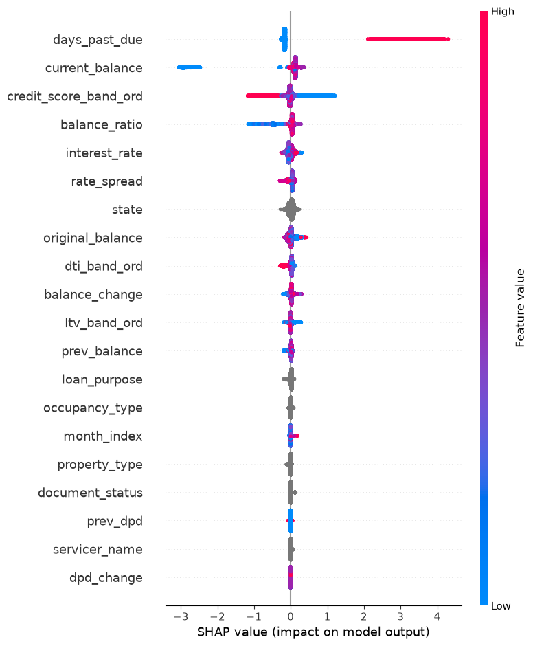
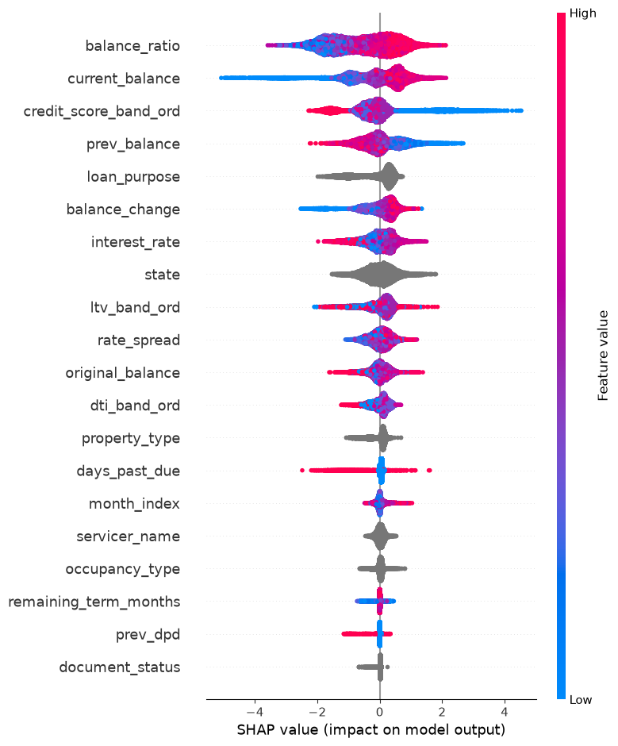
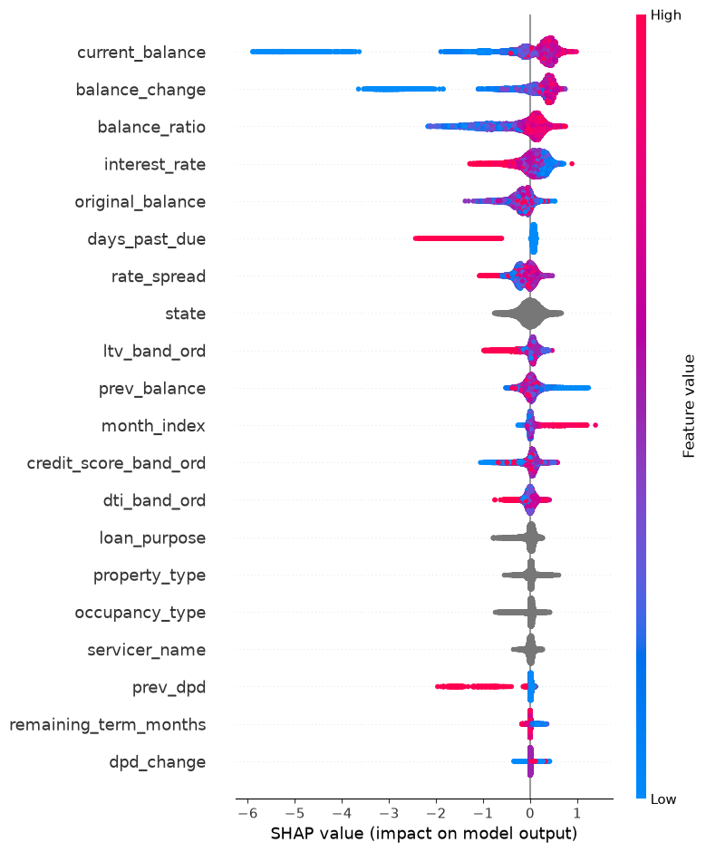
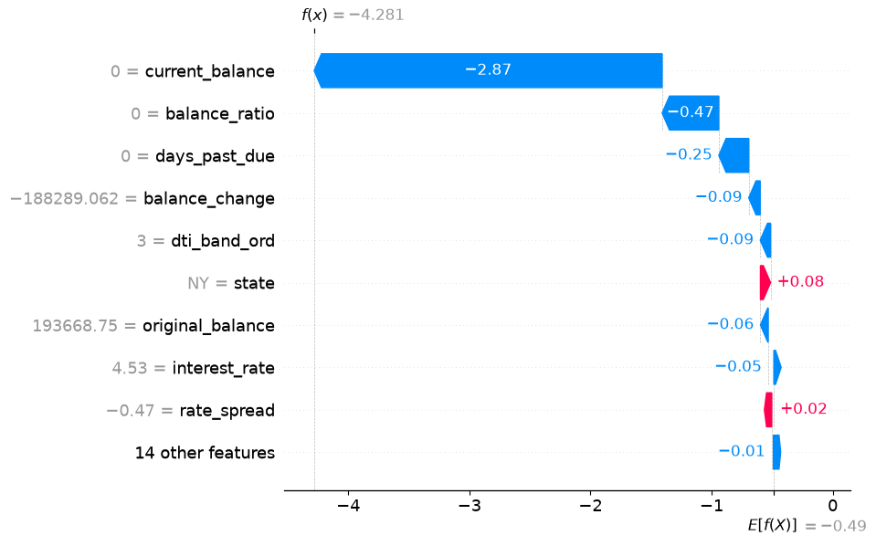

# FR-6 Explainability & Responsible AI Report

## Global Feature Importance

The SHAP summary plots below illustrate the global impact of features on the primary risk targets.

### 3-Month Delinquency

### 12-Month Default

### 12-Month Prepayment

## Local Single-Loan Explanation

A detailed SHAP waterfall plot for an anomalous loan (`LN000000`) demonstrating how specific feature values push the baseline risk up or down.

## Uncertainty & Confidence Reporting

Model confidence is explicitly surfaced in two ways:
1. **Isotonic Calibration:** Raw scores are mapped to true empirical probabilities, ensuring a `0.80` score means an 80% real-world event rate.
2. **Multi-Model Agreement:** The final `confidence` score penalizes predictions where the suite of temporal models (3m, 6m, 12m) produce contradictory risk trajectories.

## Error Analysis: False Positives & False Negatives

### Top False Positives (Predicted Default, Actual Current)

| Loan ID   |   Probability | Top Drivers                                         | Hypothesized Cause                                 |
|:----------|--------------:|:----------------------------------------------------|:---------------------------------------------------|
| LN000376  |             1 | days_past_due; balance_ratio; credit_score_band_ord | High DPD suggests delinquency, but borrower cured. |
| LN001274  |             1 | days_past_due; balance_ratio; ltv_band_ord          | High DPD suggests delinquency, but borrower cured. |
| LN001442  |             1 | days_past_due; balance_ratio; current_balance       | High DPD suggests delinquency, but borrower cured. |

### Top False Negatives (Predicted Current, Actual Default)

| Loan ID   |   Probability | Top Drivers                                         | Hypothesized Cause                                                                    |
|:----------|--------------:|:----------------------------------------------------|:--------------------------------------------------------------------------------------|
| LN004991  |          0.04 | credit_score_band_ord; days_past_due; interest_rate | Good credit score suppressed risk, missing a sudden unobserved shock (e.g. job loss). |
| LN001894  |          0.04 | credit_score_band_ord; balance_ratio; days_past_due | Good credit score suppressed risk, missing a sudden unobserved shock (e.g. job loss). |
| LN004187  |          0.04 | balance_ratio; days_past_due; balance_change        | Missing risk signal or sudden unobserved shock not reflected in panel features.       |

